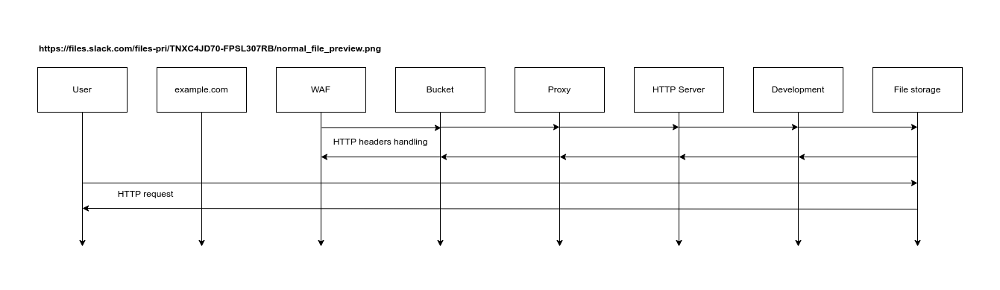
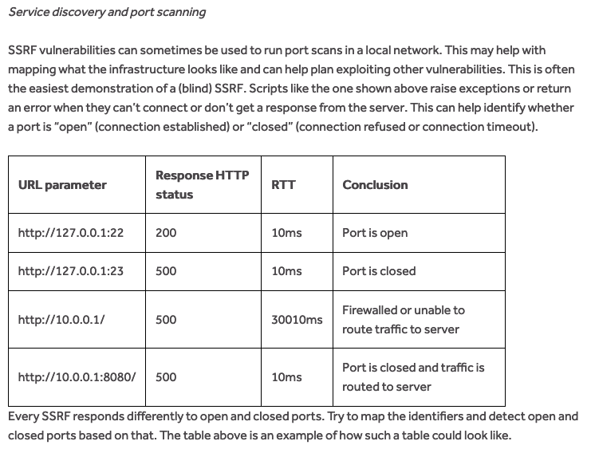

# Magoo

<div align="center">
    
</div>

Magoo is a Python debugging/fuzzing script that helps you detect misconfigurations where a backend or proxy chain trusts forwarded-style headers (for example `X-Forwarded-Host`) in ways that can lead to blind SSRF or host/redirect manipulation patterns. It is designed for large-scale testing across many URLs: load your session headers from a file, load a list of validated targets, fuzz a large set of forwarded headers one-by-one, and report any response that differs from `200 OK` along with measured request latency.

## Why this exists

Modern cloud stacks often include multiple components (CDN/WAF/reverse proxies/API gateways/origins). These components may interpret or rewrite forwarding headers in unexpected ways. A well-known class of issues occurs when an upstream validates `Host` but a downstream honors `X-Forwarded-Host` (or similar), enabling redirect manipulation and blind SSRF-style behavior. Magoo is built to quickly test for those behaviors at scale.

## How Magoo works

For each target URL, Magoo performs one HTTP request per forwarded header in its dataset. On each request, it injects a value into exactly one forwarded header (for example `X-Forwarded-Host`) while keeping the rest of the headers stable (your session headers). It measures latency per request, and reports findings when the response status code is not `200`. Redirects are not followed so that `3xx` responses are reported reliably (following redirects can hide the original `3xx` when the `Location` host fails to resolve or blocks the client).

```
(.venv) C:\magoo>python magoo.py -H artifacts/sample_headers.txt -T artifacts/sample_urls.txt --payload 127.0.0.1@custom.tld --timeout 8 --slow-threshold 5 --fast-threshold 3
[+] Possible SSRF Found! Status: 504 Elapsed: 0.031s Header: Forwarded URL: http://127.0.0.1:5000/probe
[+] Possible SSRF Found! Status: 302 Elapsed: 0.031s Header: X-Forwarded URL: http://127.0.0.1:5000/probe
[+] Possible SSRF Found! Status: 502 Elapsed: 0.000s Header: X-Forwarded-Host URL: http://127.0.0.1:5000/probe
[!] Rate limit detected! Status: 429 Elapsed: 0.016s Header: X-Forwarded-By URL: http://127.0.0.1:5000/probe
[-] Rate limit exception. Good bye!
```

## Features

- Fuzzing of an extended forwarded-header dataset (one request per header)
- Per-request latency measurement (useful for time-delay analysis)
- Reports any status code different from 200 (including 3xx and 4xx/5xx)
- Detects and reports 429 rate limiting, then aborts the scan
- Optional SOCKS proxy support (Tor) for IP rotation
- Telegram notifications (requires `bot_token` and `bot_id` environment variables)
- Local log files:
  - `stdout_log_ssrf.txt` for findings
  - `stderr_log_ssrf.txt` for errors

## Installation

Clone the repository and create a virtual environment:

```bash
git clone https://github.com/JoshuaProvoste/SSRF-Magoo.git
cd SSRF-Magoo

python3 -m venv .venv
source .venv/bin/activate
```

Install dependencies:

```bash
python3 -m pip install -r requirements.txt
```

If you plan to use SOCKS/Tor proxying, install SOCKS support for `requests`:

```bash
python3 -m pip install "requests[socks]"
```

## Telegram configuration

Magoo sends notifications via a basic Telegram bot. Export the following environment variables before running:

```bash
export bot_token="YOUR_TELEGRAM_BOT_TOKEN"
export bot_id="YOUR_CHAT_ID"
```

If these are not set, Magoo will exit.

## Usage

Basic scan:

```bash
python3 magoo.py -H headers.txt -T target_list.txt
```

### Headers file (`-H / --headers`)

This file should contain the headers you want Magoo to use for every request, including any session/authentication headers required for authenticated flows.

Example `headers.txt`:

```text
User-Agent: Mozilla/5.0 (Windows NT 10.0; Win64; x64) AppleWebKit/537.36 (KHTML, like Gecko) Chrome/120.0 Safari/537.36
Accept: text/html,application/xhtml+xml,application/xml;q=0.9,image/avif,image/webp,*/*;q=0.8
Cookie: session=value;
Authorization: Bearer <token>
```

Important notes:
- Header parsing supports values containing `:` and preserves spaces inside values.
- If your headers file contains a `Host:` header, Magoo will not overwrite it from the URL; the file value becomes the base host for injection behavior.

### Targets file (`-T / --target`)

A newline-delimited list of fully-qualified URLs to test.

Example `target_list.txt`:

```text
https://sub.example.com/path/storage/files/document.pdf
https://mirror.sub.example.com/login
https://www.example.com/assets/js/library.js
```

## Command-line options

Run `python3 magoo.py -h` to see the full help output. The main options are:

- `-H, --headers <file>`  
  Path to the headers file used for all requests.

- `-T, --target <file>`  
  Path to the URL list file.

- `--timeout <seconds>`  
  Request timeout. Default: `5`.

- `--payload <value>`  
  Literal payload injected into the fuzzed forwarded header. This overrides `--custom`.  
  Example: `--payload 127.0.0.1@custom.tld`

- `--custom <domain-or-ip>`  
  Automatically builds the injected value as `<base_host>@<custom>`, where `<base_host>` is taken from your `Host:` header (or, if absent, from the URL host).  
  Example: `--custom custom.tld` will inject something like `example.com@custom.tld`.

- `--tor <host:port | socks-url>`  
  Enables SOCKS proxying (typically Tor) for all requests. Examples:  
  - `--tor 127.0.0.1:9050` (converted to `socks5h://127.0.0.1:9050`)  
  - `--tor socks5h://127.0.0.1:9050` (used as-is)

  Note: Tor cannot route to private RFC1918 IP ranges (for example `192.168.x.x`), so this is intended for public targets.

- TLS options (mutually exclusive):
  - `--insecure` disables TLS verification (`verify=False`), and suppresses insecure warnings
  - `--verify` is kept for compatibility; TLS verification is enabled by default

- Latency thresholds:
  - `--fast-threshold <seconds>` default `3`
  - `--slow-threshold <seconds>` default `5`

These thresholds only label latency as FAST/MID/SLOW in the Telegram output; they do not alter the scanning logic.

## Examples

Inject a literal payload:

```bash
python3 magoo.py -H headers.txt -T target_list.txt --payload 127.0.0.1@custom.tld --timeout 8
```

Derive `<host>@<custom>` automatically from the base `Host`:

```bash
python3 magoo.py -H headers.txt -T target_list.txt --custom custom.tld --timeout 8
```

Use Tor SOCKS proxy (requires `requests[socks]`):

```bash
python3 magoo.py -H headers.txt -T target_list.txt --custom custom.tld --tor 127.0.0.1:9050
```

Disable TLS verification (useful for labs or targets with self-signed certs):

```bash
python3 magoo.py -H headers.txt -T target_list.txt --custom custom.tld --insecure
```

## Generating a target list (ProjectDiscovery workflow)

Magoo expects a list of valid URLs. A common workflow for unauthenticated discovery uses ProjectDiscovery tools:

1. Subdomain enumeration (`subfinder`):
```bash
subfinder -d example.com -all -o subfinder.txt
```

2. Filter live hosts (`httpx`):
```bash
httpx -l subfinder.txt -o httpx.txt
```

3. Crawl endpoints (`katana`):
```bash
katana -list httpx.txt -d 10 -jc -kf all -o katana.txt
```

4. Filter to specific status codes for scanning (`httpx`):
```bash
httpx -l katana.txt -mc 200,201,202,206,207,208,226 -o target_list.txt
```

If you need authenticated crawling, consult the documentation for each tool to supply your session headers during discovery/crawling.

# Lab: forwarded-header redirect simulator (`lab/app.py`)

This lab is a small Flask app used to reproduce and debug the forwarded-header behavior Magoo is built to detect. It exposes three routes. Two always return `200 OK`, and one route (`/probe`) returns a non-200 status when it receives a forwarded-style header value matching the pattern:

- A forwarded header contains `<host>@<custom>` (for example `example.com@custom.tld`)
- The `<host>` part must match the actual request `Host` (authority) for the request

When the trigger condition is met, `/probe` returns a random status code from a non-200 set (for example `302`, `400`, `404`, `500`, `429`, etc.). When the randomly chosen status is `302`, it also includes a `Location` header pointing to the `<custom>` value, to emulate redirect-based behavior.

## Routes

- `GET /ok-a`  
  Always returns `200`.

- `GET /ok-b`  
  Always returns `200`.

- `GET /probe`  
  Returns:
  - `200` if no trigger condition is met
  - random non-200 if a trigger condition is met  
    When the selected code is `302`, `Location` is set to a URL derived from `<custom>`.

The app also includes debug headers such as `X-Triggered-By`, `X-Trigger-Value`, and `X-Picked-Status` on triggered responses.

## Requirements

- Python 3.9+
- Flask

Install:

```bash
python3 -m venv .venv
source .venv/bin/activate
python3 -m pip install flask
```

## Run

From the repository root:

```bash
python3 lab/app.py
```

Default bind is `0.0.0.0:5000`.

If you want local-only access, edit the `app.run(...)` host to `127.0.0.1`.

## Quick tests (curl)

Baseline (no trigger):

```bash
curl -i http://127.0.0.1:5000/probe
```

Trigger with `Host: example.com` and matching left-side value:

```bash
curl -i http://127.0.0.1:5000/probe \
  -H 'Host: example.com' \
  -H 'X-Forwarded-Host: example.com@custom.tld'
```

Not triggered (left-side does not match request Host):

```bash
curl -i http://127.0.0.1:5000/probe \
  -H 'Host: example.com' \
  -H 'X-Forwarded-Host: other.com@custom.tld'
```

Notes:
- The status returned on trigger is random by design. Run multiple times to see different statuses.
- If you use a non-resolvable `custom.tld` and a client follows redirects, the client may raise DNS/connection errors. This is why Magoo should not follow redirects during detection.

## Using the lab with Magoo

1. Put a reachable lab URL in your target list, for example:
   - `http://127.0.0.1:5000/probe`

2. Ensure your headers file includes a `Host:` line matching the lab host you want as the trigger base. Example:

```text
Host: 127.0.0.1
Accept: */*
Connection: keep-alive
```

3. Run Magoo with either:
   - literal payload:
     ```bash
     python3 magoo.py -H headers.txt -T target_list.txt --payload 127.0.0.1@custom.tld
     ```
   - derived payload (recommended):
     ```bash
     python3 magoo.py -H headers.txt -T target_list.txt --custom custom.tld
     ```

Magoo will report non-200 responses and include elapsed time per request. A `429` response is reported and then the scan aborts by design.

# Background: Blind SSRF via forwarded-style headers (reference report and rationale)

This project is based on a HackerOne report describing a blind SSRF pattern caused by inconsistent header trust across a request chain (for example CDN/WAF/proxy/origin). The report focuses on `files.slack.com` behavior where the backend honored a forwarded-style header (notably `X-Forwarded-Host`) instead of relying solely on the `Host` header. In the reported scenario, the service performed host validation to reject mismatched hosts (returning `500 Internal Server Error` when `Host` was not `files.slack.com`), but the researcher demonstrated a validation bypass by appending an `@` to the hostname (for example `files.slack.com@...`). After this bypass, the backend issued a redirect and attempted to route the request using the forwarded host value, which the researcher verified by observing that the outgoing request to their controlled domain was made by a backend origin (identified as `*.amazonaws.com`, rather than the expected frontend CDN such as `cloudfront.net`). This enables blind SSRF-style behavior: attackers can induce server-side requests to internal hosts by manipulating forwarded headers, and then infer reachability of internal services using response timing (time-delay technique) even when the response body/status is not directly observable.

## Reported reproduction flow (high level)

1. Upload a file to the target application and obtain the “original” file URL (example from the report: `https://files.slack.com/files-pri/<TEAM>-<FILE>/test.png`).
2. Send a baseline request to confirm normal behavior.
3. Add a forwarded-style header such as `X-Forwarded-Host: attacker-controlled.example` and observe a server error due to host validation.
4. Bypass the host validation by setting a forwarded host value with the `@` suffix pattern, for example:
   - `X-Forwarded-Host: files.slack.com@YOUR_DOMAIN`
   This yields a redirect (for example a `302`), with `Location` pointing to `YOUR_DOMAIN/...` (or equivalent), indicating the backend is now using the forwarded host.
5. Confirm that a request is made to `YOUR_DOMAIN` and that the requester appears to be the backend origin infrastructure.
6. Replace `YOUR_DOMAIN` with an internal destination and vary ports to infer open/closed states via timing (blind SSRF): for example `169.254.169.254:PORT` or other internal addresses.

## Time-delay technique described in the report

Because the attacker may not have direct visibility into server-side response codes (blind context), the report uses response time as a side channel to classify reachability and port status. The report notes an empirical pattern:
- Response time greater than ~5 seconds tends to indicate a closed/blocked port (connection attempts hang or timeout).
- Response time under ~3 seconds can indicate:
  - an open port, or
  - a fast failure (invalid DNS, immediate reject), or
  - other fast error paths

The key point is that timing can help identify which ports are closed on valid internal hosts, which is useful for internal reconnaissance even without full response visibility.

## Impact summary (as described)

If a backend honors forwarded-style headers (especially host-related ones) in a way that overrides or conflicts with `Host` validation, attackers can potentially coerce server-side requests to arbitrary internal destinations. Even when responses are blind, timing differences can enable port scanning and internal discovery. A typical mitigation is to ensure the application consistently trusts only the correct header(s) at each hop (for example, honoring `Host` appropriately, and not allowing user-controlled forwarded headers to override routing) and to apply strict allowlists/normalization across proxy boundaries.

## Why this matters to Magoo

Magoo automates the “header fuzzing” portion of this workflow at scale:
- It takes a stable set of session headers (for authenticated or unauthenticated contexts).
- It fuzzes a large dataset of forwarded-style headers one at a time.
- It reports any response that deviates from `200 OK` and records latency per request to support time-delay analysis.

This complements manual verification and helps identify endpoints where forwarded-style header trust may cause redirect manipulation or blind SSRF-like behavior.

## References from the original README

- HackerOne report reference: `https://hackerone.com/reports/727330`
- General SSRF background: `https://www.hackerone.com/application-security/how-server-side-request-forgery-ssrf`
- Video reference included in the original README: `https://www.youtube.com/watch?v=j5_WicLwwC4`

The original README also highlights that this class of issues can appear in both authenticated and unauthenticated flows, and that the initial proof used a file endpoint (PNG) but the same pattern may apply to other endpoints that cause backend fetch/redirect behavior.





```
date1=`date +%s`; while true; do echo -ne "$(date -u --date @$((`date +%s` - $date1)) +%H:%M:%S)\r"; done
```

## Notes and limitations

- Magoo is a debugging and detection script, not a one-click exploitation tool.
- Findings are heuristic: non-200 responses and time-delay changes can indicate interesting behavior, but always require manual verification.
- Rate limiting: if a `429` is detected, Magoo will report it and abort the scan to avoid burning the target.
- Redirects are not followed to ensure `3xx` responses are reported reliably.
- For SOCKS/Tor usage, the target must be reachable through Tor (publicly routable).

## License

Copyright (c) 2026 Joshua Provoste. All rights reserved.
No license is granted to use, copy, modify, or distribute this software without explicit permission.
